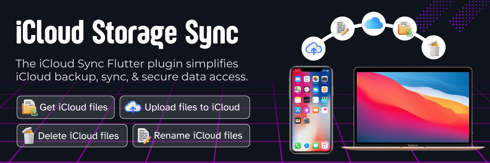
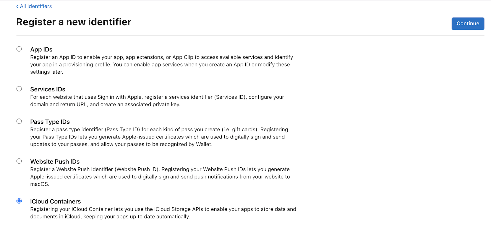
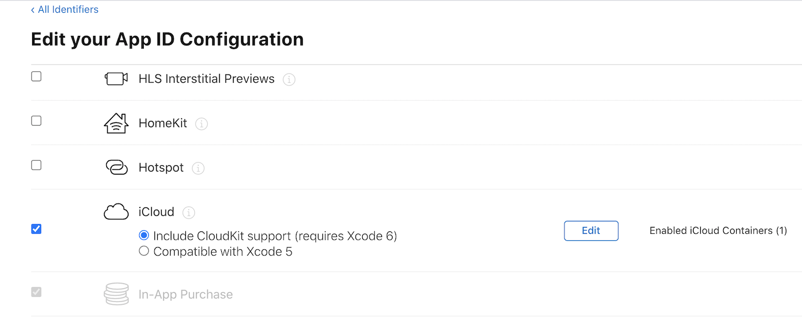
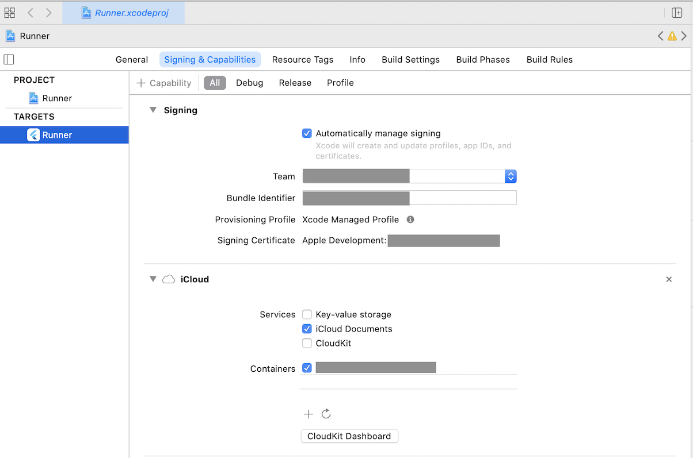

# 📦☁️ iCloud_Storage_Sync Plugin

**Seamless iCloud integration for your Flutter iOS apps!**



## 🌟 Introduction

iCloud_Storage_Sync simplifies iCloud storage integration, bringing powerful cloud capabilities to your Flutter iOS apps:

🔄 Effortless backup and sync of app data

📱💻 Consistent user experience across all devices

🔒 Secure storage and retrieval of important information

☁️ Seamless integration with the iCloud ecosystem

## ✨ Features

| Feature | Description            |
| ------- | ---------------------- |
| 📂      | Get iCloud files       |
| ⬆️      | Upload files to iCloud |
| ✏️      | Rename iCloud files    |
| 🗑️      | Delete iCloud files    |
| ↔️      | Move iCloud files      |
| 🔍      | Filter by path prefix  |
| ⏱️      | Timeout support        |

**Advanced Features:**
- 🔍 **Path Filtering** - Query specific subdirectories instead of entire container for better performance
- ⏱️ **Timeout Support** - Set time limits on metadata queries to prevent indefinite hangs
- 📊 **Progress Tracking** - Monitor upload/download progress with callbacks
- 🔄 **Stream Updates** - Receive live updates as files change in iCloud

<br>

## 🚀 Getting Started

### 1. 🛠️ Installation

Add this to your `pubspec.yaml`:

```yaml
dependencies:
  icloud_storage_sync: ^1.0.0
```

### 2. ⚙️ Install the Plugin

Run:

```bash
flutter pub get
```

### 3. 🔧 Configure Your iCloud Container ID

Update your iCloud Container ID in the example app:

**In `example/lib/controller/icloud_plugin_controller.dart`:**
```dart
final iCloudContainerId = 'iCloud.com.yourcompany.appname'; // Replace with your container ID
```

**In `example/ios/Runner/Info.plist`:**
```xml
<key>iCloud.com.yourcompany.appname</key>  <!-- Replace with your container ID -->
```

**In `example/ios/Runner/Runner.entitlements` and `RunnerDebug.entitlements`:**
```xml
<string>iCloud.com.yourcompany.appname</string>  <!-- Replace with your container ID -->
```

> ℹ️ **Note:** Your iCloud Container ID should match the format: `iCloud.<your-team-id>.<your-bundle-id>`

### 4. 💻 Usage

Import in your Dart code:

```dart
import 'package:icloud_storage_sync/icloud_storage_sync.dart';
```

## 📋 Prerequisites

Before diving in, make sure you have:

☑️ An Apple Developer account

☑️ App ID and iCloud Container ID

☑️ iCloud capability enabled and assigned

☑️ iCloud capability configured in Xcode

🔍 See [How to set up iCloud Container](#-how-to-set-up-icloud-container-and-enable-the-capability) for step-by-step instructions.

<br>

## 🧰 API Examples

### 📥 Getting iCloud Files

```dart
Future<List<CloudFiles>> getCloudFiles({required String containerId}) async {
  return await icloudSyncPlugin.getCloudFiles(containerId: containerId);
}
```

### 📂 Gathering Files with Path Filtering & Timeout

```dart
// Gather files with optional path prefix filtering
Future<List<ICloudFile>> gatherFilesFromSubdirectory({
  required String containerId,
  required String pathPrefix,
}) async {
  return await icloudSyncPlugin.gather(
    containerId: containerId,
    relativePathPrefix: pathPrefix, // e.g., 'Documents/', 'Projects/MyApp/'
  );
}

// Gather files with timeout to prevent indefinite hangs
Future<List<ICloudFile>> gatherFilesWithTimeout({
  required String containerId,
  required Duration timeout,
}) async {
  try {
    return await icloudSyncPlugin.gather(
      containerId: containerId,
      timeout: timeout, // e.g., Duration(seconds: 30)
    );
  } on PlatformException catch (e) {
    if (e.code == 'METADATA_QUERY_TIMEOUT') {
      debugPrint('iCloud query timed out');
    }
    return [];
  }
}

// Combine both features for optimal performance
Future<List<ICloudFile>> gatherFilesOptimized({
  required String containerId,
  required String pathPrefix,
}) async {
  return await icloudSyncPlugin.gather(
    containerId: containerId,
    relativePathPrefix: pathPrefix,
    timeout: Duration(seconds: 30),
  );
}
```

**Features:**
- 📂 `relativePathPrefix` - Filter to specific subdirectory for faster queries
- ⏱️ `timeout` - Set time limit to prevent indefinite hangs
- 🔄 Both parameters are optional and backwards compatible

### 📤 Uploading Files to iCloud

```dart
Future<void> upload({
  required String containerId,
  required String filePath,
  String? destinationRelativePath,
  StreamHandler<double>? onProgress,
}) async {
  await icloudSyncPlugin.upload(
    containerId: containerId,
    filePath: filePath,
    destinationRelativePath: destinationRelativePath,
    onProgress: onProgress,
  );
}
```

### 🏷️ Renaming iCloud Files

```dart
Future<void> rename({
  required String containerId,
  required String relativePath,
  required String newName,
}) async {
  await icloudSyncPlugin.rename(
    containerId: containerId,
    relativePath: relativePath,
    newName: newName,
  );
}
```

### 🗑️ Deleting iCloud Files

```dart
Future<void> delete({
  required String containerId,
  required String relativePath,
  required bool isDirectory
}) async {
  await icloudSyncPlugin.delete(
    containerId: containerId,
    relativePath: relativePath,
    isDirectory: isDirectory
  );
}
```

### 🔄 Replace iCloud Files

```dart
Future replaceFile({
  required String updatedFilePath,
  required String relativePath
  }) async {
    await icloudSyncPlugin.replace(
      containerId: iCloudContainerId,
      updatedFilePath: updatedFilePath,
      relativePath: relativePath,
    );
}
```

### 🔀 Moving iCloud Files

```dart
Future<void> move({
  required String containerId,
  required String fromRelativePath,
  required String toRelativePath,
}) async {
  await IcloudSyncPlatform.instance.move(
    containerId: containerId,
    fromRelativePath: fromRelativePath,
    toRelativePath: toRelativePath,
  );
}
```

<br>

## 🛠 How to set up iCloud Container and enable the capability

1. **👤 Log in to your Apple Developer account** and select 'Certificates, IDs & Profiles'.

2. **🆔 Create an App ID** (if needed) and an **iCloud Containers ID**:

   

3. **🔗 Assign the iCloud Container** to your App ID:

   

4. **💻 In Xcode, enable iCloud capability** and select your container:

   

<br>

## 🤝 Contributing


<br/>

## 🙏 Acknowledgements

- Thanks to all the contributors who have helped shape this plugin
- Apple for providing the iCloud infrastructure

---

Made with ❤️ by the DevCodeSpace
